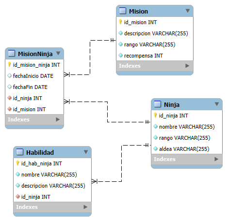
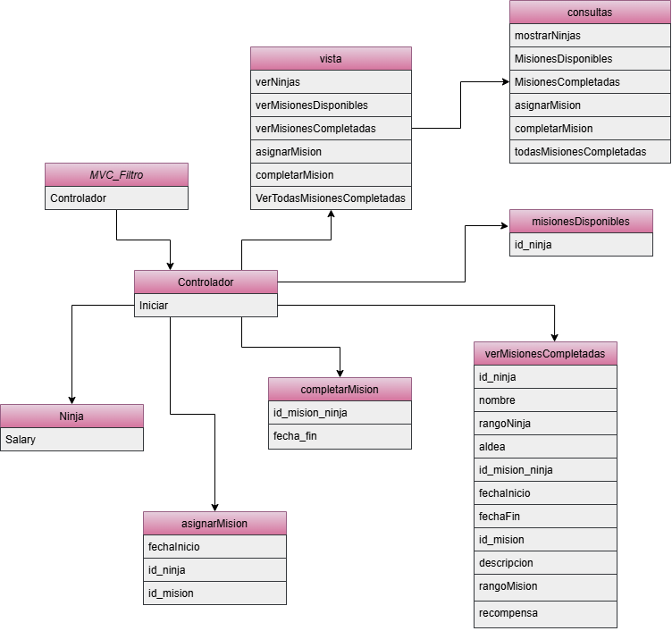

# Aldea Konoha

Este es un sistema de gestión de misiones y datos de los ninjas para mejorar la eficiencia y la coordinación entre los equipos.

## Descripción

Con este aplicativo se busca gestionar su información de manera integral para modernizar el sistema de gestión y facilitar su uso.

## Tecnologías utilizadas

|Java|MySQL|
|--|--|
|||

## Estructura

## Diagrama E-R

## Diagrama de clases

## Características

|Paquete|Descripción|
|--|--|
|**MVC_Filtro**|Archivo main donde se podrá ejecutar el aplicativo.|
|**Controlador**|Creación del menú y llamado a las funcionalidades para dar solución.|
|**modelo**|Creación de constructores y archivo de consultas para traer información de la base de datos.|
|**vista**|En este paquete es donde se pide la información necesaria para realizar correctamente cada método.|

## Instrucciones

* **1.** Clonar el repositorio.

* **2.** Abrir su editor de código y elegir el archivo que acaba de clonar.

* **3.** Elegir el archivo MVC_Filtro que está dentro del paquete con su mismo nombre y ejecutarlo.

* **4.** Elegir las opciones de su preferencia.

## Desarrollado por

Este exámen fue realizado por Alejandra Machuca, estudiante de CampusLands como filtro del módulo de Java.